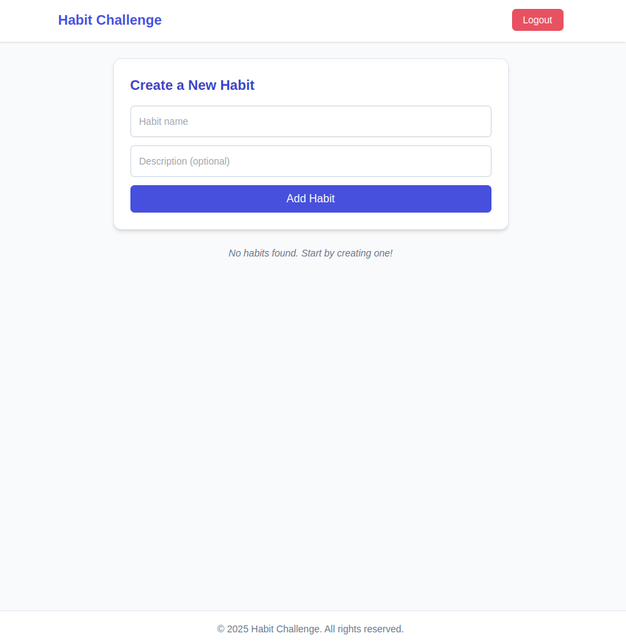
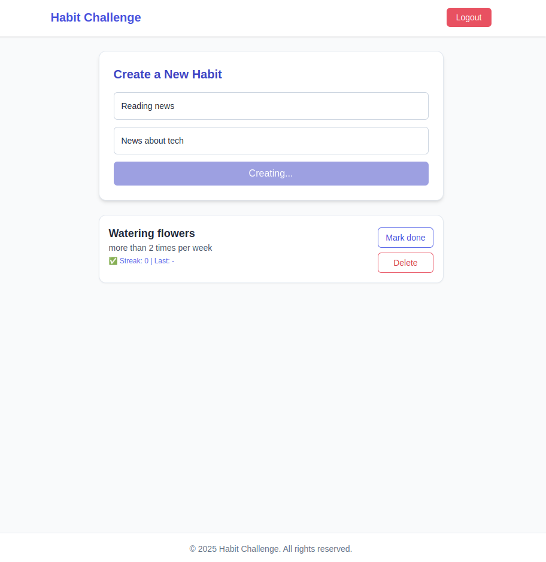
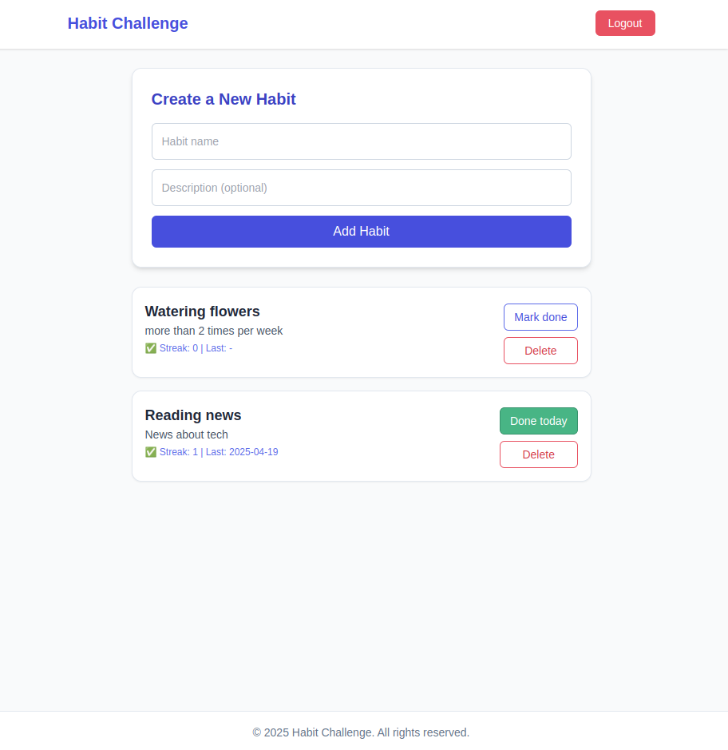
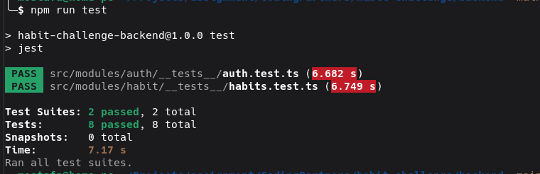

# Habit Challenge

A full-stack habit-tracking app.  
Users can create daily habits, toggle completion for today, and manage their habit list.

## Features

- [x] User login (mock credentials)
- [x] Create a new habit
- [x] View all habits
- [x] Toggle habit as done/not done for today
- [x] Delete a habit
- [x] Responsive and clean UI
- [x] Token-based auth with protected routes
- [ ] Dockerized the app

## Tech Stack

### Backend

- **Node.js** – JavaScript runtime
- **TypeScript** – Strong typing and modern syntax
- **Express** – Web server and routing
- **uuid** – ID generation for habits and tokens
- **date-fns** – Streak and date utilities
- **dotenv** – Environment variable management
- **fs/promises** – File-based storage
- **Jest** – Testing framework\


### Frontend
 
- React with TypeScript
- Tailwind CSS (modern styling)
- Axios for API communication
- React Router


## Getting Started

#### Prerequisites

- Node.js 18+
- npm 9+
- Docker (optional, for containerization)

### Running the App by Docker

JUST RUN THIS LINE:

```bash
docker-compose up --build
```

This command will:

- Start Backend [http://localhost:5011](http://localhost:3000)
- Start Frontend [http://localhost:3000](http://localhost:5173)

### Verifying the Services

```bash
# Status
docker ps 

# Backend LOG
docker logs habit_backend

# Frontend LOG
docker logs habit_frontend

```

### Stopping the Containers

```bash
docker-compose down
```


#### Setup Backend manually

```bash
cd backend

npm install
cp .env.example .env
# Edit .env to adjust port, repo type, or auth credentials

npm run dev    # for development
# or
npm run build && npm start  # for production
```

The API will be accessible at `http://localhost:3000` (or your configured PORT)

#### Setup Frontend manually

```bash
cd frontend

npm install
cp .env.example .env
# Edit .env to adjust port, repo type, or auth credentials

npm run dev    # for development
# or
npm run build && npm start  # for production
```

### Testing

This project uses [Jest](https://jestjs.io/) and [Supertest](https://github.com/ladjs/supertest) for backend testing.

```bash
cd backend
npm test

#TODO: add frontend tests
```

### TODO

##### Backend

- [x] TypeScript + Express API setup
- [x] Modular folder structure (controller, service, repository, etc.)
- [x] Habit functionality
- [x] Toggle today's completion
- [x] Streak calculation logic
- [x] Last completed date (habit history)
- [x] In-memory & file-based repositories
- [x] Configurable repo type via `.env`
- [x] Authorization middleware (Bearer token)
- [x] Token memory store
- [x] Add base config by `.env.example`
- [x] Simple doc by README
- [x] Add unit tests
- [ ] Use a real authentication system (JWT + refresh token)
- [ ] Add user registration and habit ownership
- [ ] Add pagination to GET /habits
- [ ] Add timestamps (createdAt / updatedAt) to habits
- [ ] Use a real database (e.g. PostgreSQL)
- [x] Dockerize the backend
- [ ] Add GitHub Actions for CI (lint, test, build, publish)
- [ ] Document the API using Swagger

##### Frontend

- [x] TypeScript + React setup
- [x] Modular folder structure (components, hooks, utils, etc.)
- [x] Responsive design with Tailwind CSS
- [x] Axios for API communication
- [x] React Router for navigation
- [x] Protected routes for authenticated users
- [x] User login (mock credentials)
- [x] Create a new habit
- [x] View all habits
- [x] Toggle habit as done/not done for today
- [x] Delete a habit
- [x] Loading and error handling
- [x] Dockerize the frontend
- [ ] Improve directory structure and file naming conventions
- [ ] Add unit tests
- [ ] ESLinting and Prettier for code formatting

##### Others
- [ ] Add CI/CD pipeline for automated testing and deployment
- [ ] E2E testing for the entire application
- [x] Dockerize by docker-compose the app (frontend + backend)

## FAQ

#### What kind of project structure is used here?

This project follows a **feature-based modular architecture**.  
Each feature (such as `habit` and `auth`) is implemented as a self-contained module containing its own controller, service, repository, and type definitions.

This structure is inspired by Domain-Driven Design (DDD) and helps maintain clear separation of concerns.

#### Why is everything grouped under `/modules/`?

Grouping features under `modules/` keeps the codebase organized and scalable.  
It ensures:

- All feature-related logic is colocated
- Clear boundaries between domains
- Easier refactoring or modularization in the future

#### Why not use a flat layered structure?

While a flat structure with folders like `controllers/`, `services/`, and `repositories/` can work in smaller apps, it quickly becomes unmanageable as the application grows.  
A feature-based structure helps:

- Keep related files together
- Reduce cross-feature coupling
- Make testing and navigation easier

#### Can this project be converted into a flat (layout) structure?

Yes. It would be possible to move controllers, services, and repositories into global folders like `controllers/`, `services/`, and `repositories/`.  
However, that would:

- Reduce modularity
- Make it harder to reason about feature-specific logic
- Be less scalable as new domains are added

This project intentionally uses a modular structure to demonstrate best practices and readiness for future growth.

#### Why use DTOs like `HabitCreateDto` and `LoginDto`?

DTOs (Data Transfer Objects) define the structure of expected inputs.  
They improve:

- Type safety
- Readability of request handling
- Integration with validation tools like Zod or Joi
- Testability of API endpoints

#### Why is `auth/` a separate module?

Authentication logic often includes multiple components like controller, config, token management, and middleware.  
Placing them under a dedicated `auth/` module allows encapsulation and flexibility for future expansion.

#### Why is `middleware/` outside `modules/`?

Middlewares are often shared across multiple features and routes.  
Placing them in a global `middleware/` folder keeps them reusable and framework-agnostic.

#### Why is the repository selected dynamically?

The repository implementation (in-memory vs. file-based) is selected at runtime based on the environment variable `REPO_TYPE`.  
This allows for easy switching between development and production environments.

#### Why are some folder names singular (e.g., `repository/`)?

Singular folder names like `repository/`, `service/`, and `controller/` reflect their purpose within a single feature.  
Plural forms are usually reserved for global/shared collections, which this structure avoids for better modularity.

## References

This project is inspired by modern best practices for scalable Node.js and TypeScript backend development.

- [NestJS Documentation – Modular Architecture](https://docs.nestjs.com/modules)  
  While NestJS is a framework, its concepts around modularity and layering are broadly applicable.

- [DDD Community – Official Site](https://domainlanguage.com/ddd/)  
  The official site from Eric Evans, the originator of Domain-Driven Design.

- [Microsoft TypeScript Handbook](https://www.typescriptlang.org/docs/handbook/intro.html)  
  Official TypeScript documentation, recommended for typing, structuring, and modularization practices.

- [Conventional Commits](https://www.conventionalcommits.org/en/v1.0.0/)  
  Standard format for commit messages used to improve clarity and automate releases.

## Screenshots






